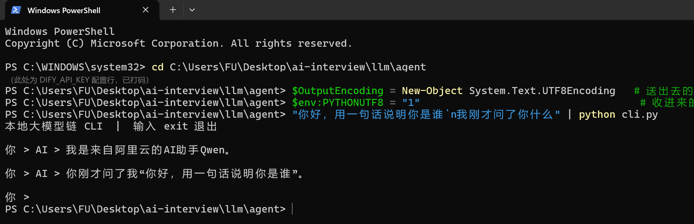
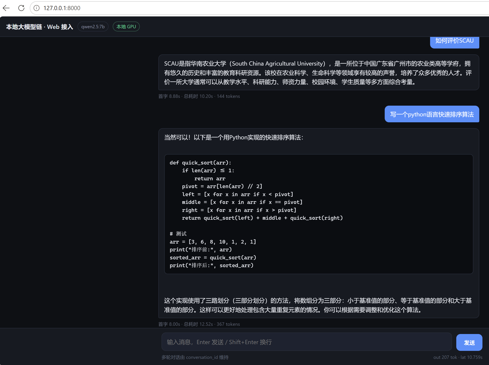

# 任务 1-2 · 智能体与 API 接入

把本地部署的大模型作为 **model provider** 接入智能体平台，再通过 **API** 暴露给自研应用。

链路：`应用（CLI / Web） → Dify API → Ollama(qwen2.5:7b) → 本机 RTX 5070 GPU`

## 目录

| 文件 | 说明 |
|---|---|
| `dify_client.py` | **Dify 接入模块**：配置、鉴权、请求组装、阻塞/流式调用、错误归一化 |
| `cli.py` | 命令行入口：只做终端交互，多轮对话 |
| `server.py` | Web 后端：只做路由——静态托管 + 转发 `/api/chat`（SSE 流式） |
| `index.html` | Web 前端：只做 UI 组织与订阅，单文件无框架 |
| `images/` | 界面实测截图 |

全部**只依赖 Python 标准库**，无需 `pip install`。

## 代码结构

按"主程序只负责模块组装"来分层，与 Dify 通信的细节全部收敛在模块里：

```text
index.html ──HTTP / SSE──> server.py ─┐
                                       ├──> dify_client.py ──> Dify API ──> Ollama
cli.py     ────调用─────────────────> ┘
```

- `dify_client.py` 是**唯一**知道 Dify 端点、鉴权头、`response_mode` 的地方；
  `cli.py` / `server.py` 内不含任何 HTTP 代码，只负责「取输入 → 调模块 → 呈现」。
- `dify_client.py` 对外只抛一种异常 `DifyError`，上层不必 import `urllib`。
- 流式与否由 `chat()` / `chat_stream()` 两个方法决定，前端传什么 `response_mode` 都不影响。

## 1. 本地模型作为 model provider

Dify 1.x 起模型改为**插件化**，需先在「插件 → 市场」安装 **Ollama** 插件，
再到「设置 → 模型供应商 → Ollama → 添加模型」填写：

| 字段 | 值 |
|---|---|
| 模型名称 | `qwen2.5:7b` |
| Base URL | `http://host.docker.internal:11434` |
| 模型类型 | LLM |
| 上下文长度 | 8192 |
| 最大 Token | 4096 |

### 两个必须的前置条件

否则点「保存」必然报 `Connection refused`：

**① Ollama 需绑到 0.0.0.0**

Dify 跑在 Docker 容器里，容器中的 `localhost` 是容器自己，够不到宿主机。

```powershell
[Environment]::SetEnvironmentVariable("OLLAMA_HOST","0.0.0.0:11434","User")
```

设完**必须完全退出 Ollama 再重新打开**（该变量只在进程启动时读取一次）。

验收：`netstat -ano | findstr 11434` 显示 `0.0.0.0:11434`，而不是 `127.0.0.1:11434`。

**② 放行 Dify 的 SSRF 代理**

Dify 内置的 squid 代理默认拒绝一切私网地址，而 `host.docker.internal`
解析后正是私网地址，会被拦掉。在 `dify/docker/.env` 中追加：

```text
SSRF_PROXY_ALLOW_PRIVATE_DOMAINS=host.docker.internal
```

改完 `docker compose up -d` 重建 `ssrf_proxy`（该变量会被注入 `api`、
`plugin_daemon`、`worker` 等 5 个服务）。

> 用域名而非 CIDR 白名单，放行范围最小。

## 2. 创建应用并获取 API Key

新建「聊天助手」应用 → 选模型 `qwen2.5:7b` → **发布**（不发布 API 会拒绝访问）
→ 左侧「访问 API」→ 创建 API 密钥，形如 `app-xxxx`。

| 项 | 值 |
|---|---|
| 端点 | `POST http://localhost/v1/chat-messages` |
| 鉴权 | `Authorization: Bearer app-xxxx` |
| 必填字段 | `query`、`user`、`inputs`（可传 `{}`） |
| 多轮对话 | 回传上一轮返回的 `conversation_id` |
| 流式 | `response_mode` 取 `streaming`，响应为 SSE |

## 3. 运行

密钥通过**环境变量**传入，不要写进代码。

**CLI**

```powershell
cd llm/agent
$env:DIFY_API_KEY="app-xxxxxxxx"
python cli.py
```

**Web**

```powershell
cd llm/agent
$env:DIFY_API_KEY="app-xxxxxxxx"
python server.py
# 浏览器打开 http://127.0.0.1:8000
```

代理同样由 `dify_client.py` 统一禁用（`urllib.request.ProxyHandler({})`），
避免发给 `127.0.0.1` 的请求被环境里残留的代理设置带偏。

**Web 端对外接口**

| 方法 | 路径 | 说明 |
|---|---|---|
| `GET` | `/` | 返回 `index.html` |
| `GET` | `/api/health` | 服务探针，返回 `{"ok", "key_loaded", "key_ok"}`；不依赖 Dify 是否存活 |
| `POST` | `/api/chat` | 请求体 `{"query", "inputs", "user", "conversation_id"}`，响应 `text/event-stream` |

> 密钥为占位符或含非 ASCII 字符时，`key_ok` 为 `false`，且 `cli.py` / `server.py`
> 会在启动阶段直接给出中文提示，而不是抛出难以理解的编码错误。

## 4. 实测结果

### 4.1 CLI 端到端用例（多轮上下文）

密钥通过**环境变量**传入，不落代码。以下为 Windows PowerShell 下的一次完整会话：

```powershell
cd C:\Users\FU\Desktop\ai-interview\llm\agent
$env:DIFY_API_KEY="app-xxxxxxxx"
$OutputEncoding = New-Object System.Text.UTF8Encoding   # 送出去的
$env:PYTHONUTF8 = "1"                                   # 收进来的
"你好，用一句话说明你是谁`n我刚才问了你什么" | python cli.py
```

实测输出：

```text
本地大模型链 CLI  |  输入 exit 退出

你 > AI > 我是来自阿里云的AI助手Qwen。

你 > AI > 你刚才问了我"你好，用一句话说明你是谁"。
```



**判据**：第二轮回答正确复述了第一轮的问题 ⇒ `conversation_id` 回传生效，**多轮上下文可用**（不是单轮能回就算过）。

> **Windows PowerShell 5.1 的坑（实测踩过）**：其 `$OutputEncoding` 默认为 `us-ascii`，
> 通过**管道**向外部程序送中文会全部变成 `?`，模型会回答"看起来你输入了一些无法辨识的符号"。
> 因此用管道时**两侧都要显式设为 UTF-8**（即上面那两行）。
> 只在 `你 >` 后**直接手打中文**则不受影响 —— Python 在 Windows 上读控制台走的是控制台 API，
> 与终端代码页（`gb2312`）无关。

### 4.2 Web 端实测（流式输出）

浏览器打开 `http://127.0.0.1:8000`，回答逐字出现，底部实时显示首字延迟与 token 数。



**判据**：文字**逐字**出现（而非整段一次性弹出）⇒ SSE 流式转发生效；markdown 代码围栏被渲染为 `<pre>` 代码块。

### 4.3 性能与资源

| 指标 | 值 |
|---|---|
| 首字延迟（TTFT） | 0.45 s |
| 总延迟 | 0.51 s |
| prompt / completion | 34 / 20 tokens |
| 推理设备 | 100% GPU（`ollama ps`） |

## 5. 排障

| 现象 | 原因 | 处理 |
|---|---|---|
| `Connection refused`（11434） | Ollama 未运行，或未绑 0.0.0.0 | 见上文前置条件 ① |
| 容器内 `curl host.docker.internal:11434` 不通 | squid 拦了私网地址 | 见上文前置条件 ② |
| 保存模型时报连接错误 | Base URL 填成了 `127.0.0.1` | 必须用 `host.docker.internal` |
| `docker compose up -d` 拉不动镜像 | Docker Hub 被 DNS 污染 | 配 `registry-mirrors` 或走代理 |
| 模型回答"看起来你输入了一些无法辨识的符号" | PowerShell 5.1 的 `$OutputEncoding` 默认为 `us-ascii`，管道送中文变成 `?` | 见上文 4.1 的 PowerShell 提示 |
| `[请求失败] 未设置环境变量 DIFY_API_KEY` | 密钥未设，或设在了另一个终端窗口 | `$env:` 只对当前窗口有效，重设一遍 |
| `HTTP Error 403` | 应用未**发布** | 到 Dify 点一次发布 |
| `转发失败: 'latin-1' codec can't encode characters in position 11-14` | `DIFY_API_KEY` 里填的是含中文的占位符，不是真实密钥；该请求在客户端就被中断，因此看不到 401 | 换成 `app-xxxxxxxx` 形式的真实密钥 |
| 启动即提示「DIFY_API_KEY 含非 ASCII 字符」 | 同上，程序已在启动阶段拦下 | 重设环境变量后重启 |

## 6. 进度

| 日期 | 内容 |
|---|---|
| 2026-10-04 | Dify 自部署（15 个容器）→ Ollama 作 model provider → 建应用并发布取 Key → CLI / Web 两个应用跑通 |
| 2026-10-04 | 抽出 `dify_client.py`：`cli.py` / `server.py` 收敛为纯组装层；`/api/health` 增加 `key_ok` 字段，并对非 ASCII 密钥做前置校验 |
