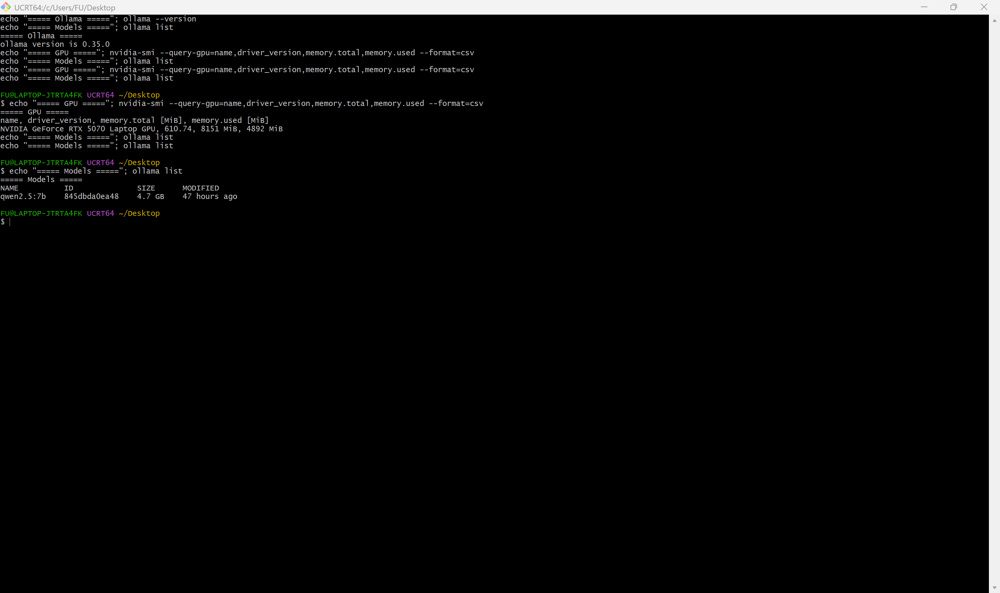
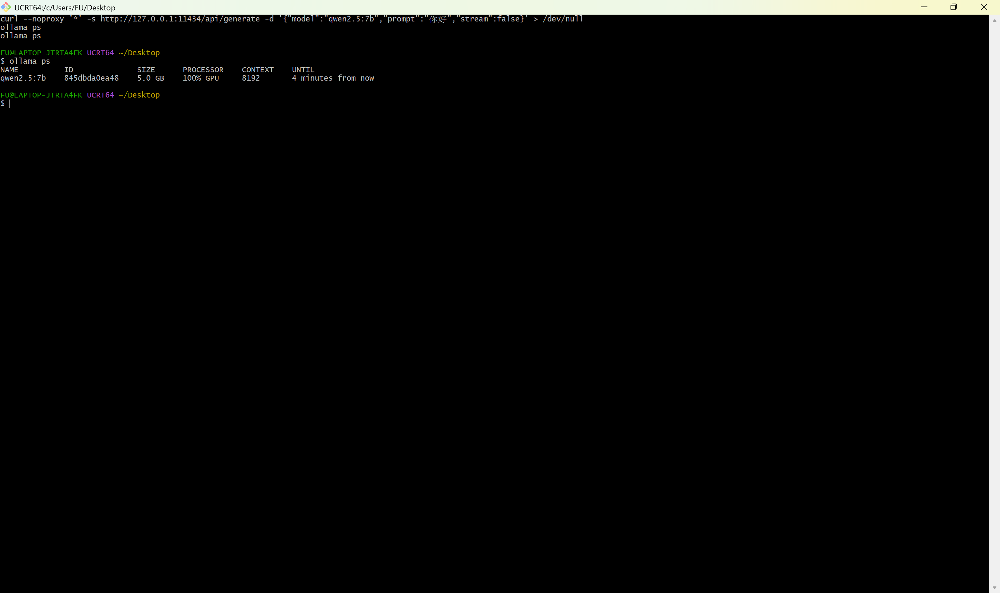
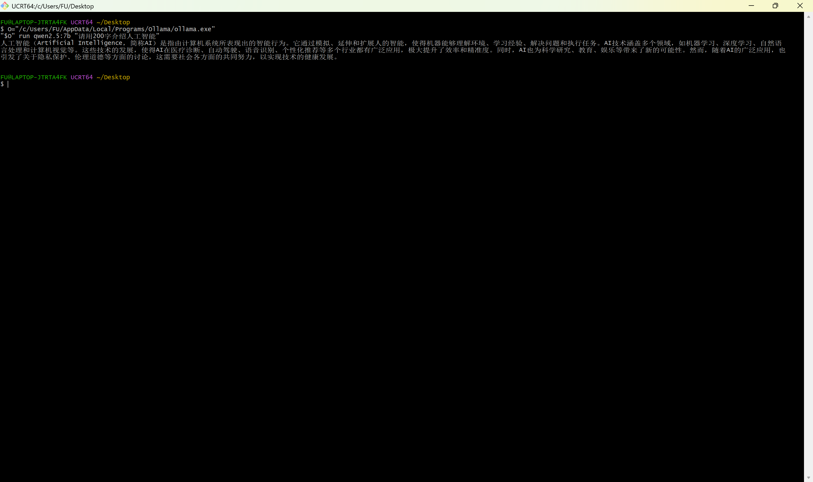

# 本地大模型性能测试报告

- **日期**：2026-10-03
- **测试对象**：本地部署的 `qwen2.5:7b`（Ollama）
- **结论速览**：冷启动瓶颈在**模型加载**（5.33 s，占总耗时 58%）；模型驻留后首字延迟降至 **0.03 s**，生成速度稳定在 **55–60 tok/s**，全程 **100% GPU**。

---

## 1. 测试环境

| 项 | 值 |
|---|---|
| GPU | NVIDIA GeForce RTX 5070 Laptop GPU（8151 MB 显存） |
| 显卡驱动 | 610.74 |
| Ollama | v0.35.0 |
| 模型 | qwen2.5:7b（7.6B / Q4_K_M / 4.7 GB） |
| 模型能力 | completion、tools |
| 模型上下文上限 | 32768 tokens |
| 运行时上下文 | 8192 tokens（Ollama 默认） |
| 模型存放 | `D:\OllamaModels`（通过 `OLLAMA_MODELS` 从 C 盘迁出） |
| 服务地址 | `http://127.0.0.1:11434` |

> 表中 Ollama 版本为**测试当日（2026-10-03）的实际版本**。该实例次日因自动升级中断被重装为 **v0.35.1**（模型与推理链路未受影响，`ollama ps` 仍为 100% GPU）；如需最新版本下的数据，重跑 `bench.sh` 即可。

## 2. 测试方法

**为什么用 HTTP API 而不是 `ollama run`**：CLI 交互会话会累积上下文，导致两轮请求的 prompt token 数不一致（早期实测出现过 37 与 45 的情况），改用 API 单次请求可保证两轮输入完全一致。

| 项 | 设置 |
|---|---|
| 端点 | `POST /api/generate`，`stream=false` |
| prompt | `请用200字介绍人工智能的发展历史、当前现状和未来趋势。`（固定 46 tokens） |
| temperature | `0`（消除采样随机性） |
| num_predict | `512`（上限；实际输出 217–222 tokens） |
| 冷启动定义 | 先 `ollama stop qwen2.5:7b`，等待 10 s 确认显存归零，再发请求 |
| 热启动定义 | 紧接着发出第二次完全相同的请求 |

复现命令：`bash llm/test/bench.sh`

## 3. 测试结果

### 3.1 单请求基线

| 指标 | 冷启动 | 热启动 |
|---|---|---|
| 模型加载 `load_duration` | 5.333 s | 0.007 s |
| 提示处理 `prompt_eval_duration` | 0.123 s | 0.021 s |
| 生成 `eval_duration` | 3.763 s | 3.902 s |
| **首字延迟 TTFT** | **5.46 s** | **0.03 s** |
| 提示处理速度 | 374.2 tok/s | 2218.6 tok/s |
| **生成速度 `eval rate`** | **59.0 tok/s** | **55.6 tok/s** |
| 输入 / 输出 tokens | 46 / 222 | 46 / 217 |
| 总耗时 | 9.224 s | 3.942 s |

> 热启动的「提示处理速度 2218.6 tok/s」是 **KV cache 命中**的结果（首次计算的 46 个 token 已被缓存复用），不代表真实吞吐能力，此处仅用于说明缓存已生效。

### 3.2 资源占用（模型驻留时实测）

| 指标 | 值 |
|---|---|
| 运行位置 | **100% GPU** |
| `ollama ps` 报告占用 | 5.0 GB |
| `nvidia-smi` 实测占用 | 4892 MiB ≈ 4.8 GB / 8 GB（余量约 3.2 GB） |
| 空闲时 GPU 利用率 | 0 %（生成期间瞬时拉满） |

## 4. 结论

1. **冷启动的瓶颈是模型加载，不是推理**。加载 5.333 s 占总耗时 58%，而生成 222 个 token 只花 3.76 s。演示前应先预热模型，否则首次交互需要等待 5 秒以上。
2. **模型驻留后首字延迟降至 0.03 s**，与冷启动相差约两个数量级，交互体验是「字立刻往外蹦」。
3. **生成速度稳定在 55–60 tok/s**，约为中文阅读速度（5–8 字/秒）的 10 倍以上，满足实时对话需求。
4. **全程 100% GPU，显存占用 4.8 / 8 GB**。剩余约 3.2 GB 不足以再驻留第二个 7B 模型（需约 5 GB），因此多模型并行不可行；14B 需量化 + CPU offload，速度将不可接受。

## 5. 与早期 `--verbose` 测试的差异说明

早期用 `ollama run --verbose`（默认参数，输出 124–149 tokens）测得冷/热生成速度为 69.3 / 60.7 tok/s，本次为 59.0 / 55.6 tok/s。差异主要来自**输出样本长度不同**（本次 217–222 tokens 更长，结果更可信），而非机器性能变化。

## 6. 原始数据

- `raw-cold.json` —— 冷启动请求的 API 原始返回（含全部时间戳字段）
- `raw-hot.json` —— 热启动请求的 API 原始返回

## 7. 截图

**① 测试环境** —— `nvidia-smi` 与 `ollama --version` 同屏

**② 模型驻留状态** —— `ollama ps` 显示 `100% GPU` 与 5.0 GB 显存占用

**③ 真实对话效果** —— 一次完整问答

