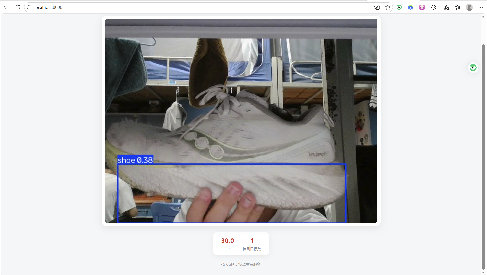
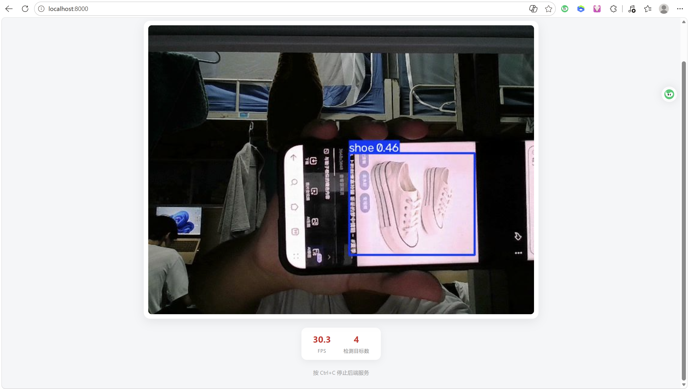

# infer/ · 摄像头实时推理

任务二的最后一环：加载训练好的 `best.pt`，对**电脑摄像头**做实时目标检测，
结果通过浏览器查看。这是出题人博客文末点名要求的环节。

## 设计：前后端解耦

出题人规范第 4 条要求「前端只负责 UI 组织与订阅，后端只负责计算与服务的推送」，
本目录严格按这个边界拆分：

```
摄像头 ──► camera.py ──► app.py ──HTTP──► templates/index.html
          (抓帧+推理)   (只做组装)          (只做显示)
```

| 文件 | 职责 | 不负责 |
|---|---|---|
| `model_loader.py` | 加载 `best.pt`、绑定设备 | 不碰摄像头、不碰 HTTP |
| `camera.py` | 抓帧 → 推理 → 编码 JPEG（后台线程） | 不碰 HTTP、不碰页面 |
| `app.py` | 组装三者 + 暴露 3 个路由 | 不写推理逻辑、不写页面 |
| `templates/index.html` | 订阅画面 + 显示统计 | **零推理逻辑** |

后端提供三个接口：

| 路由 | 作用 |
|---|---|
| `GET /` | 返回前端页面 |
| `GET /video_feed` | MJPEG 视频流，前端 `` 直接订阅 |
| `GET /stats` | 当前帧率与检测目标数（JSON） |

> 为什么推理放在后台线程？单帧推理几十毫秒，若在 HTTP 请求里同步做，
> 多个页面同时刷新会互相阻塞。独立线程只推理一次，所有订阅者共享结果。

> 权重是**自动选取**的：`model_loader.py` 扫描 `../runs/detect/runs/train/exp*/weights/best.pt`
> 取最新的一份。重训后无需改任何代码，直接启动就是新模型。

## 依赖

除 `ultralytics` / `opencv-python` 外，只多一个 **Flask**：

```bash
D:\envs\yolo\Scripts\python.exe -m pip install flask
```

## 运行

```bash
cd C:\Users\FU\Desktop\ai-interview\yolo\infer
D:\envs\yolo\Scripts\python.exe app.py
```

然后浏览器打开 **http://localhost:8000** 即可看到实时画面。

可选参数：

```bash
python app.py --camera 1 --port 8080 --conf 0.4    # 换摄像头 / 换端口 / 调阈值
```

> ⚠️ 必须在 `infer\` 目录下启动。`app.py` 的 `from camera import ...` 是按当前目录找同目录模块，
> 在别处运行会报 `ModuleNotFoundError`。

## 实测效果

用第二轮自采数据（60 张鞋子图，单类别 `shoe`）训练出的权重做实时检测：



*真鞋举到镜头前 —— 稳定检出 `shoe`（conf 0.38，30.0 FPS）*



*手机屏幕里显示的鞋子图片 —— 同样能检出（conf 0.46）*

> 实测硬件：RTX 5070 Laptop ｜ yolov8n @640 ｜ 帧率稳定在 **30 FPS** 左右。

## 重新训练自己的数据

本目录只负责**推理**，数据的采集与训练见 [`../script/`](../script/) 与 [`../yolo_README.md`](../yolo_README.md)。
若用手机拍照，先进 `script/resize.py` 把图缩小并摆正 EXIF 方向，再打标。

## 常见问题

| 现象 | 原因 / 解法 |
|---|---|
| `无法打开摄像头 0` | 摄像头被其他程序占用（微信、腾讯会议、另一个推理实例） |
| 浏览器提示「拒绝连接」 | 后端没起来。必须先在 `infer\` 目录启动 `app.py`，看到 `[后端] 摄像头 0 推理中` 才是成功 |
| 页面一直转圈不显示画面 | 后端没起来、端口被占用（换 `--port`），或摄像头没打开（看终端那行提示） |
| 检测不到任何目标 | 模型只认训练时的类别；换类别前必须先重训 |
| **真鞋检不出，但手机屏幕里的鞋照片能检出** | 典型的**域差异**：训练图是手机俯拍特写（目标占画面 60~80%、光线充足、背景干净），而摄像头是平视、目标占比小、且台灯直射导致**过曝泛白**。**避免强光直射 / 降低环境光、让目标占画面 1/3 以上**后可正常检出；根治办法是用**同一个摄像头在实际推理位置**补拍数据重训 |
| 检测时好时坏，要摆好角度和距离 | 同上。训练数据拍摄条件太单一（60 张、基本同一视角与光照），泛化不足；补拍多角度 / 多光照数据重训可改善 |
| 帧率只有个位数 | 正常。RTX 5070 上 yolov8n @640 约 20~40 FPS，CPU 会明显更慢 |

---

## 补充（2026-10-09）：被 Harness 复用的入口

任务四的 Harness 通过 `yolo/detect_cli.py` 调用本目录的 `model_loader.load_model()`，
做「单次检测 → 输出 JSON」；再由 `harness/tools/yolo_detect.py` 起子进程调用它。

```
harness（系统 Python） ──subprocess──► D:/envs/yolo/Scripts/python.exe
                                          └─ yolo/detect_cli.py
                                               └─ from model_loader import load_model
```

本目录原有的 `app.py` / `camera.py`（Flask + MJPEG）保持不变，两者互不干扰：
- `app.py` 服务浏览器看实时画面
- `detect_cli.py` 供 agent 单次问"你看到了什么"
