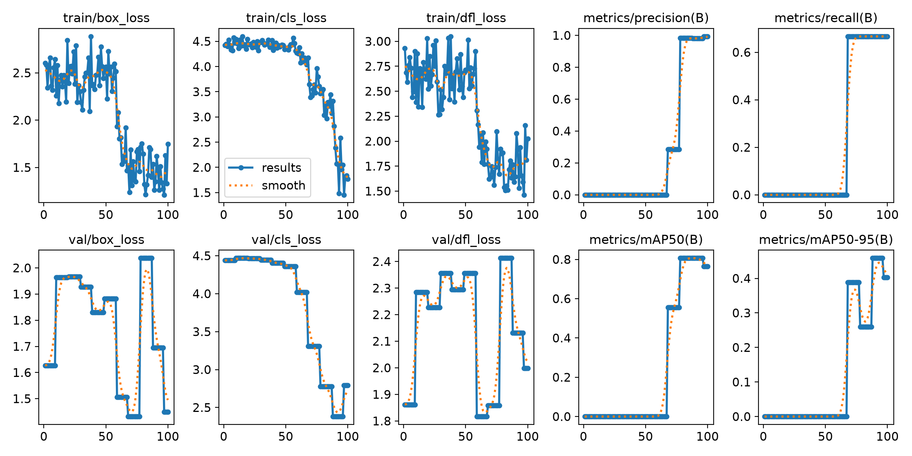
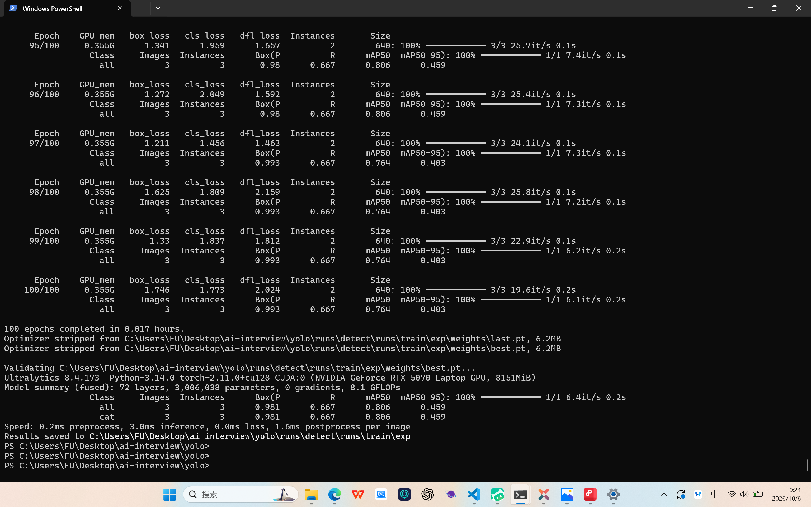

# yolo/ · 视觉处理链

任务二：用自采数据训练目标检测模型，并调用摄像头实时推理。

**当前状态**：全流程已跑通（打标 → 转标注 → 划分 → 训练 → 摄像头实时推理），**并已实机验证**。
共完成两轮训练：

| 轮次 | 数据 | 类别 | 产物 |
|---|---|---|---|
| 第一次 | 出题人给的 10 张示例图 | `nc=2`（cat / dog） | [`first_train/`](first_train/first_train_README.md) |
| 第二次 | **自采 60 张鞋子图** | `nc=1`（shoe） | `runs/detect/runs/train/exp-2`（实时推理用的就是它） |

## 技术路线

沿用出题人博客《【小白】【超详细】从零开始搭建自己的 YOLO》及其配套仓库
[`Linmoqian/yolo_train`](https://github.com/Linmoqian/yolo_train) 的现成流程：

```
your_data/   图片 + json 标注
   ├─ script/resize.py       手机照片预处理：缩到长边 1280 + 摆正 EXIF 方向
   ├─ script/json2txt.py     json → YOLO txt（CLASSES 须与 dataset.yaml 的 names 一致）
   ├─ script/DataProess.py   划分 train / val / test
   ├─ main.py                读 config/train.yaml 训练
   └─ infer/app.py           加载 best.pt + 摄像头 → 浏览器实时查看
```

本机只在**环境**与**数据**上适配，流程本身不改。

## 运行环境

| 项 | 值 |
|---|---|
| 虚拟环境 | `D:\envs\yolo`（官方 Python 3.14 + `venv`） |
| PyTorch | 2.11.0+cu128 ｜ CUDA 12.8（`torch.cuda.is_available() = True`） |
| Ultralytics | 8.4.173 ｜ OpenCV 5.0.0 ｜ Flask 3.1.3 |
| GPU | RTX 5070 Laptop（Blackwell / sm_120） |
| 标注工具 | X-AnyLabeling（`Windows-CUDA12` 版，exe 双开即用） |
| 训练参数 | yolov8n ｜ imgsz=640 ｜ batch=2 ｜ epochs=100 |
| 数据集（第一次） | 示例 10 张 ｜ `nc=2`（cat / dog）｜ train 6 / val 3 / test 1 |
| 数据集（第二次） | 自采 60 张 ｜ `nc=1`（shoe）｜ train 36 / val 18 / test 6 |

装环境（在 D 盘建独立环境，避免占系统盘）：

```bash
python -m venv D:\envs\yolo
source /d/envs/yolo/Scripts/activate
pip install --index-url https://download.pytorch.org/whl/cu128 torch torchvision
pip install ultralytics
python -c "import torch; print(torch.__version__, torch.cuda.is_available())"
```

> 小包（如 Flask）直接走清华镜像 `-i https://pypi.tuna.tsinghua.edu.cn/simple` 即可，
> 校内直连镜像往往比挂代理更快；只有 torch 这类大件才需要额外指定源与代理。

## 踩坑记录（三处对出题人原版的必要偏离）

1. **必须用 cu128 的 wheel**。RTX 5070 是 Blackwell（sm_120），CUDA 12.7 及以下的预编译包跑起来会报
   `no kernel image is available for execution on the device`。
2. **用 venv 而非 Miniforge**。本机 C 盘紧张，Miniforge 默认装 C 盘且体积大；
   `venv` 可整体建在 D 盘，隔离、好删，也不动系统 Python。
3. **`main.py` 必须加 `if __name__ == '__main__':` 保护**（出题人原版没有）。

   - **现象**：训练在 `Plotting labels ...` 之后中断，`runs/.../exp-N/` 里只留下 `args.yaml` 和 `labels.jpg`，
     **从不生成 `weights/best.pt`**；终端报
     ```
     RuntimeError: DataLoader worker (pid(s) ...) exited unexpectedly
     ```
   - **根因**：Windows 下 DataLoader 用 **spawn** 启动子进程，子进程会**重新导入 `__main__`**。
     `main.py` 顶层没有入口保护，于是子进程又执行了一遍 `YOLO(...).train(...)` → 递归 → worker 崩溃。
     真正的错误在子进程里：`An attempt has been made to start a new process before the current process has finished its bootstrapping phase`。
   - **修法**：把训练逻辑包进 `def main():`，再用 `if __name__ == '__main__': main()` 启动
     （同时满足出题人规范「主程序只负责模块的组装」）。Linux 用 fork 不受影响，所以原版能跑。

> 另注：训练前 ultralytics 会为 AMP 检查**联网下载一次 `yolo26n.pt`**（约 5 MB），
> 属正常行为；本机已缓存，**训练过程不需要联网**。

## 使用步骤

当前配置已指向**第二轮数据**（`your_data2/` → `dataset2/`），三条命令即可复现：

```bash
cd C:\Users\FU\Desktop\ai-interview\yolo
D:\envs\yolo\Scripts\python.exe script\json2txt.py      # json 标注 → YOLO txt
D:\envs\yolo\Scripts\python.exe script\DataProess.py    # 划分 train / val / test
D:\envs\yolo\Scripts\python.exe main.py                 # 训练
```

> ① 三条命令的**工作目录必须停在 `yolo\`**：`main.py` 里 `config/...` 与
> `dataset.yaml` 里的 `path: dataset2` 都是相对路径，换目录会报找不到数据集。
> ② 用 `python.exe` 全路径可绕开 PowerShell 执行策略对 `Activate.ps1` 的拦截。

**重新造数据时**要先改三处，且**必须在打标之前改**（顺序反了标注会被静默丢弃）：

| 文件 | 改什么 |
|---|---|
| `script/json2txt.py` | `INPUT_DIR`（图片目录）、`CLASSES`（类别列表） |
| `script/DataProess.py` | `INPUT_DIR`、`OUTPUT_DIR` |
| `config/dataset.yaml` | `path`、`nc`、`names`（**顺序必须与 `CLASSES` 一致**） |

打标用 X-AnyLabeling 打开数据目录，**矩形或多边形都可以**（`json2txt.py` 只取顶点集合的外接矩形）；
标签必须与 `CLASSES` 完全一致（**大小写不符会被静默跳过**），`Ctrl+S` 保存为同名 `.json`。

## 训练结果

### 第一次 · 出题人示例 10 张图

所有参数为默认值（100 epochs / imgsz 640 / batch 2），耗时约 **59 s**：

| 指标 | 值 |
|---|---|
| Precision | 0.981 |
| Recall | 0.986 |
| **mAP50** | **0.866** |
| mAP50-95 | 0.459 |

> ⚠️ 验证集仅 3 张图，指标**只用于确认管道打通**，不代表真实性能。





产物归档在 [`first_train/`](first_train/first_train_README.md)。

### 第二次 · 自采 60 张鞋子图（单类别 `shoe`）

数据为**手机拍摄 + 部分网图**，覆盖多角度、单只与一双；划分 train 36 / val 18 / test 6。
同样 100 epochs / imgsz 640 / batch 2，耗时约 **2.66 分钟**：

| 指标 | 值 |
|---|---|
| Precision | 0.712 |
| Recall | 0.810 |
| **mAP50** | **0.882** |
| mAP50-95 | 0.509 |

> 验证集 18 张 / 21 个实例 —— 说明标注时多数图是「两只鞋各一个框」。
> 样本量是第一轮的 6 倍，这组指标比第一轮可信得多，但 60 张仍属小样本。

## 目录结构

| 路径 | 内容 |
|---|---|
| `yolo_README.md` | 本说明（环境、路线、卡点、步骤） |
| `main.py` | 训练入口（组装模型 + 配置 + 参数） |
| `config/train.yaml` | 训练超参数（epochs / imgsz / batch …） |
| `config/dataset.yaml` | 数据集路径与类别（当前指向 `dataset2`，`nc=1`，`shoe`） |
| `script/resize.py` | 手机照片预处理（缩图 + 摆正 EXIF 方向） |
| `script/json2txt.py` | 标注转换（json → YOLO txt） |
| `script/DataProess.py` | 数据集划分 |
| `your_data/` | 第一轮数据（示例 10 张，cat / dog） |
| `your_data2/` | **第二轮数据（自采 60 张，shoe）** |
| `first_train/` | 第一次训练的产物归档（说明 + 截图 + 曲线） |
| `infer/` | 摄像头实时推理（Flask 后端 + HTML 前端，前后端解耦） |
| `dataset/` `dataset2/` `runs/` `*.pt` | 训练与划分产物，**仓库不提交**（见根 `.gitignore`） |

## 摄像头实时推理

代码在 [`infer/`](infer/infer_README.md)，采用 **Flask 后端 + HTML 前端**，严格按规范第 4 条解耦：
后端（`app.py` + `camera.py` + `model_loader.py`）只做推理与推流，前端（`index.html`）只做显示与订阅。

```bash
cd C:\Users\FU\Desktop\ai-interview\yolo\infer
D:\envs\yolo\Scripts\python.exe app.py
# 浏览器打开 http://localhost:8000
```

技术选型说明：社区同类项目多为 **Flask + MJPEG**（服务端抓帧、浏览器订阅），
本目录沿用该成熟做法；未采用 Ultralytics 官方的 `solutions.Inference`（依赖 Streamlit，
前后端耦合，与规范第 4 条相悖）。

**实测**：真鞋与手机屏幕图片均能实时检出，帧率稳定 **30 FPS**。截图见
[`infer/images/`](infer/images/) 与 [`infer/infer_README.md`](infer/infer_README.md)。

## 实测踩坑：域差异（真鞋检不出）

推理刚跑通时出现过「页面正常、FPS 正常，但什么都检不出」的现象，排查后确认是**域差异**，不是代码问题：

- **训练图**：手机**近距离俯拍特写**，鞋子占画面 60~80%、地砖背景、光线充足；
- **推理画面**：摄像头**平视**，目标占比小，且台灯直射导致**过曝泛白**，背景杂乱（床、衣物、人）。

模型学到的是「特定拍摄条件下的鞋」，而不是「鞋」本身。所以出现了**手机屏幕里的鞋照片能检出、真鞋反而检不出**
的怪现象 —— 前者构图与训练图接近，后者视角/尺度/光照全变了。

- ❌ 调低置信度阈值**无效**（实测 conf 0.10 仍为 0 框，0.05 只有 1 个 0.058 的弱框）；
- ✅ **改善光照**（避免强光直射、减少过曝）+ **让目标占画面 1/3 以上**，即可正常检出；
- ✅ **根治方向**：用**同一个摄像头**在实际推理的位置与光照下补拍 40~60 张，混入原数据重新训练。

## 进度

| 日期 | 内容 |
|---|---|
| 10-04~05 | 对照出题人博客与仓库确定路线；建 `D:\envs\yolo`；装好 torch 2.11.0+cu128 + ultralytics 8.4.173，`cuda.is_available()` 验证通过；下载 X-AnyLabeling（CUDA12 版）；素材与脚本拷入本目录 |
| 10-05 | X-AnyLabeling 标注 10 张图（标签全部 `cat` / `dog`）；`json2txt.py` 转出 10 个 txt；`DataProess.py` 划分 6 / 3 / 1；删掉 `main.py` 里引发 `SyntaxWarning` 的 ASCII art |
| 10-06 | 定位并修复 Windows 多进程入口保护问题（见踩坑 3）；**训练跑通**（100 epochs，mAP50 0.866），产物归档至 `first_train/` |
| 10-07 | 新增 `infer/` 摄像头实时推理（Flask + MJPEG，前后端解耦）与 `script/resize.py`；自采 60 张鞋子图完成标注与**第二轮训练**（mAP50 0.882）；**实时推理实机验证通过**（30 FPS），并定位「检不出」的域差异问题 |

## 待办

- [x] 用 X-AnyLabeling 标注 10 张图（类名与 `dataset.yaml` 的 `names` 对齐）
- [x] `python script/json2txt.py` → `python script/DataProess.py`
- [x] `python main.py` 训练跑通，产出 `best.pt` 与 `results.png`
- [x] 训练产物与截图归档到 `first_train/`
- [x] 摄像头实时推理 demo（`infer/`，出题人点名要求）
- [x] 采集自己的数据 → 重新打标训练 → 用新模型做实时推理
- [ ] 补拍实际推理场景的数据混入重训，改善泛化能力（可选优化）
